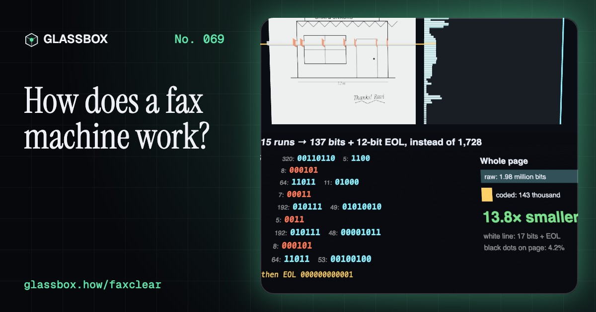
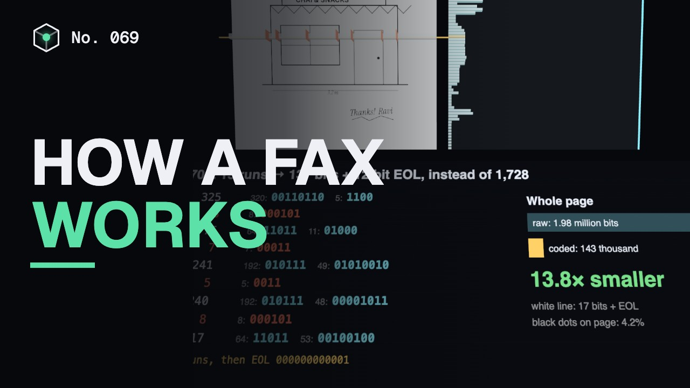
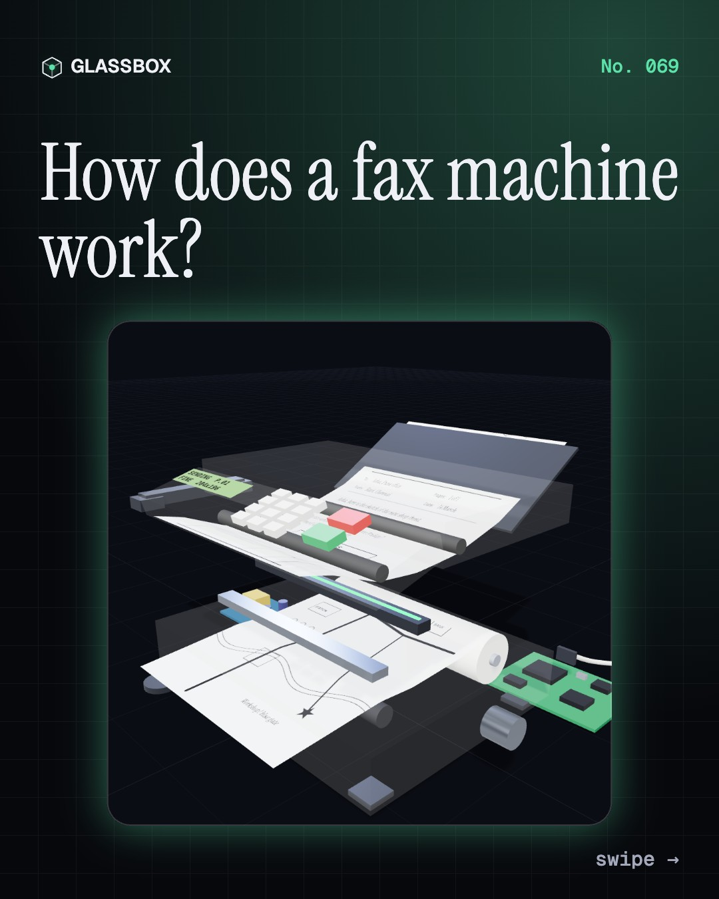
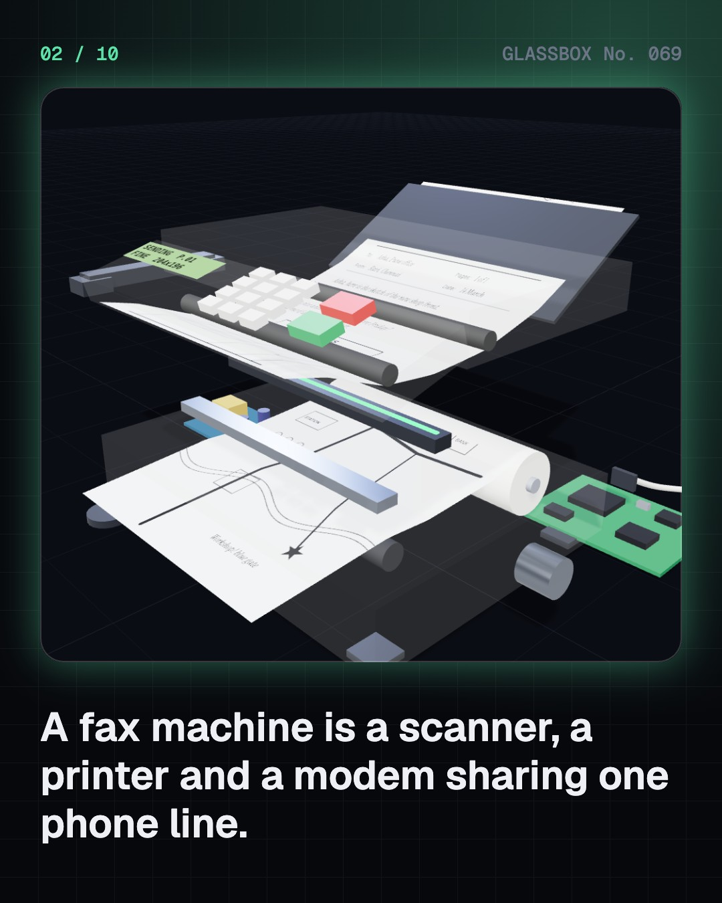
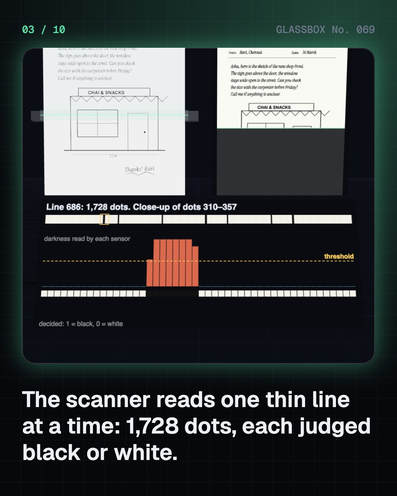
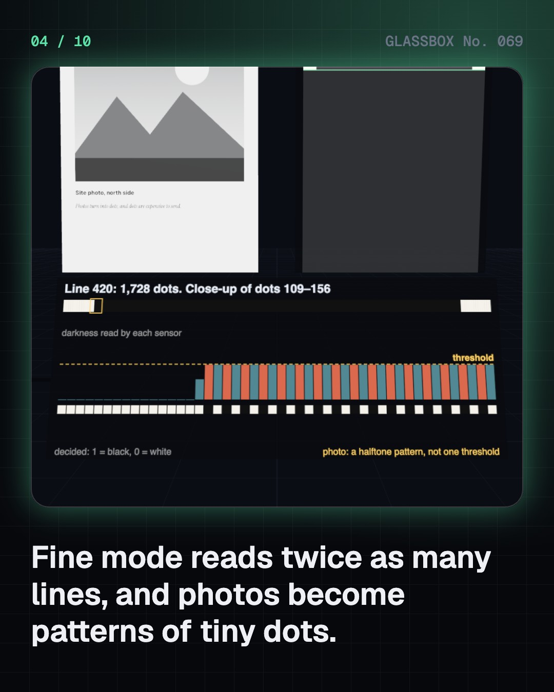

<!-- glassbox:start -->
<!-- Generated from glassbox.json by the Glassbox hub (npm run readme -- faxclear). Edit glassbox.json, not this block. -->
<p align="center"><a href="https://glassbox-production-fd52.up.railway.app/e/faxclear/"></a></p>

<h1 align="center">FaxClear</h1>

<p align="center"><b>How does a fax machine work?</b><br>A fax turns your page into 2 million dots, squeezes them 10 to 20 times with a clever code book, and sings them down a phone line. Scan your own drawing, read the real run codes, hear the handshake, and watch line noise smear a page until error correction fixes it.</p>

<p align="center"><a href="https://glassbox-production-fd52.up.railway.app/faxclear/"><b>▶ Play with it</b></a> &nbsp;·&nbsp; <a href="https://glassbox-production-fd52.up.railway.app/e/faxclear/">Read the 60-second explainer</a> &nbsp;·&nbsp; <a href="https://glassbox-production-fd52.up.railway.app/faxclear/glassbox/reel.mp4">Watch the 40-second video</a></p>

<p align="center">
  <a href="https://glassbox-production-fd52.up.railway.app/e/faxclear/"></a>
  <a href="https://glassbox-production-fd52.up.railway.app/e/faxclear/"></a>
  <a href="LICENSE"></a>
  <a href="LICENSE-CONTENT.md"></a>
  <a href="#privacy"></a>
</p>

## In 60 seconds

1. **Three machines in one box.** A fax is a scanner, a modem and a printer sharing one phone line. The page you send slides over a contact image sensor bar; the page you receive comes off a roll of thermal paper under a row of tiny heaters.
2. **A page becomes dots.** The scanner reads one thin line at a time: 1,728 dots across 215 mm, about 204 per inch. Each dot is judged black or white against a threshold. Standard mode takes 3.85 lines per mm (204 × 98 dpi), fine mode 7.7 (204 × 196): about 2 million dots for an A4 page.
3. **Runs, not dots.** Sending every dot at 9,600 bit/s would take over three minutes. So each line is sent as runs of white and black, and each run length becomes a Modified Huffman code: common runs get codes of 2 to 4 bits, and an all-white line costs 17 bits plus a 12-bit end-of-line. A letter shrinks 10 to 20 times; a halftone photo, all tiny dots, can come out bigger than the raw bits.
4. **The fax song.** A phone line carries only sound, about 300–3,400 Hz. The caller beeps at 1,100 Hz, the answerer replies at 2,100 Hz, and they agree on settings at 300 bit/s with two warbling tones. After a training burst, the page pours through as a hiss: 2,400 changes a second, 4 bits each for V.29 at 9,600 bit/s, 6 each for V.17 at 14,400.
5. **Printing, and fixing errors.** The receiver decodes the runs and fires 1,728 heaters, one per dot, against paper that turns black at about 100 °C. A flipped bit throws the codes out of step and smears a whole line. Error correction mode sends data in checked 256-byte frames and resends only the bad ones.
6. **Fax today.** Over the internet, one lost packet can break the modem sound, so T.38 (1998) sends the fax data in packets with spare copies. Fax survives where a phone number and a delivery report count: clinics, courts, government offices, and in Japan. In 1990s India, STD/PCO booths carried many a business fax.

## Words worth knowing

| Term | Meaning |
|---|---|
| **Contact image sensor** | A page-wide bar of LEDs, lenses and light sensors that reads one line of the page at a time. |
| **Scan line** | One thin strip across the page: 1,728 dots in a Group 3 fax. |
| **Resolution** | Dots per inch across and down the page: 204 × 98 standard, 204 × 196 fine. |
| **Run-length encoding** | Describing a line by how many white and black dots come in a row. |
| **Modified Huffman** | The fax code book that gives short codes to common run lengths. |
| **Modem** | A modulator-demodulator that turns bits into sound and back. |
| **Handshake** | The opening exchange where two fax machines agree on speed and resolution. |
| **Thermal paper** | Paper coated with a dye and developer that turn black when heated. |
| **Error correction mode** | Sending fax data in checked frames and resending only the damaged ones. |
| **T.38** | The standard for sending fax data, rather than fax sound, over the internet. |

## A short history

**180 years of sending pages down a wire, from swinging pendulums to packets on the internet.**

- **1843** · A patent for sending pictures by wire (Alexander Bain, London, United Kingdom)
- **1865** · The first public fax service (Giovanni Caselli and the French telegraph service, Paris and Lyon, France)
- **1906** · A photograph by wire (Arthur Korn, Germany)
- **1924** · Wirephoto: 15 photos over the phone network (AT&T, Cleveland to New York, USA)
- **1964** · Xerox LDX (Xerox, USA)
- **1980** · Group 3 and T.4: digital fax (CCITT (now ITU-T), Geneva, Switzerland)
- **1985** · The fax boom (Mostly Japanese makers, Worldwide)
- **1990** · India's STD/PCO booths (Indian telecom policy, Sam Pitroda and C-DOT, India)

The full story, with 25 moments, charts, people and 24 sources: [glassbox.how/e/faxclear/history](https://glassbox-production-fd52.up.railway.app/e/faxclear/history/). The data lives in [`history.json`](history.json).

## Video and slides

Made with the Glassbox studio from this box's storyboard (`window.glassbox.director`). Free to reuse under CC BY 4.0.

<a href="https://glassbox-production-fd52.up.railway.app/faxclear/glassbox/video.mp4"></a>

<p><a href="glassbox/slide-1.jpg"></a> <a href="glassbox/slide-2.jpg"></a> <a href="glassbox/slide-3.jpg"></a> <a href="glassbox/slide-4.jpg"></a></p>

| File | What | Size |
|---|---|---|
| [`glassbox/reel.mp4`](https://glassbox-production-fd52.up.railway.app/faxclear/glassbox/reel.mp4) | Reel / Short, with captions and soundtrack | 1080×1920 |
| [`glassbox/video.mp4`](https://glassbox-production-fd52.up.railway.app/faxclear/glassbox/video.mp4) | YouTube video, with captions and soundtrack | 1920×1080 |
| `glassbox/slide-1…10.jpg` | Instagram carousel | 1080×1350 |
| `glassbox/thumb.jpg` | YouTube thumbnail | 1280×720 |
| `glassbox/cover.jpg` | Share card and repo social preview | 1200×630 |
| [`glassbox/history-reel.mp4`](https://glassbox-production-fd52.up.railway.app/faxclear/glassbox/history-reel.mp4) | “History in 10 moments” Reel / Short | 1080×1920 |
| `glassbox/history-slide-*.jpg` | History carousel | 1080×1350 |
| `glassbox/post.json` | Post copy and schedule used by the publish kit | |

## Privacy

This box has no accounts and no ads, and it ships its own fonts and libraries. When you run it yourself it sends nothing anywhere. On glassbox.how, the site's `/bar.js` also loads Glassbox's analytics: **Google Analytics** to count visits (it asks first in the EU, UK and Switzerland, and stays off when your browser sends Global Privacy Control or Do Not Track) and **ClickTrust** to detect bots.

It remembers a few things **in your own browser only**, and never sends them anywhere:

| Browser storage key | What it holds |
|---|---|
| `faxclear.v1` | Which chapters you have opened, your best quiz scores, and sound on or off. |

Exactly what each one sees is at [glassbox.how/privacy](https://glassbox-production-fd52.up.railway.app/privacy/).

## Licences

- **Code:** [MIT](LICENSE). Use it, change it, ship it.
- **Explanations, text, images and videos** (`glassbox.json`, `glassbox/`): [CC BY 4.0](LICENSE-CONTENT.md). Credit “Glassbox, glassbox.how/e/faxclear”.
- **Third-party parts** keep their own licences: [three.js](https://threejs.org) (MIT), [Geist, Instrument Serif](https://openfontlicense.org) (SIL OFL 1.1).
- The Glassbox name and logo aren't covered by either licence. See the [terms](https://glassbox-production-fd52.up.railway.app/terms/).

Found a mistake? [Open an issue](https://github.com/bdeeps/faxclear/issues). Corrections happen in public.
<!-- glassbox:end -->

## Run it

It's plain HTML, CSS and JavaScript. No build step and no dependencies. Run locally, it contacts no other website.

```bash
python3 -m http.server 8000
```

Three.js and the fonts ship in `vendor/` and `fonts/`, so it also works offline.

Then open http://localhost:8000.

## How it's built

| File | What |
|---|---|
| `index.html`, `css/app.css` | The page and its styles |
| `js/app.js`, `js/stage.js`, `js/ui.js`, `js/kit.js` | The shared Glassbox 3D engine: chapters, 3D stage, controls, quiz, video director |
| `js/chapters/*.js` | One file per chapter: the 3D model, controls, text, key terms, quiz and video scenes |
| `js/fax.js` | FaxClear's shared models: the Group 3 page grid, a real Modified Huffman coder and decoder, the T.30 handshake and modem specs, procedural fax sounds (Web Audio), line noise and ECM, and a generic desktop fax in 3D |
| `glassbox.json` | Title, question, explainer beats, key terms, browser storage and credits shown on glassbox.how |
| `reel` in each chapter | The storyboard the Glassbox studio records into short videos |
| `glassbox/` | The published video, slides, thumbnail and post copy |
| `fonts/`, `vendor/three/` | Self-hosted Geist and Instrument Serif (SIL OFL 1.1) and three.js (MIT) |
